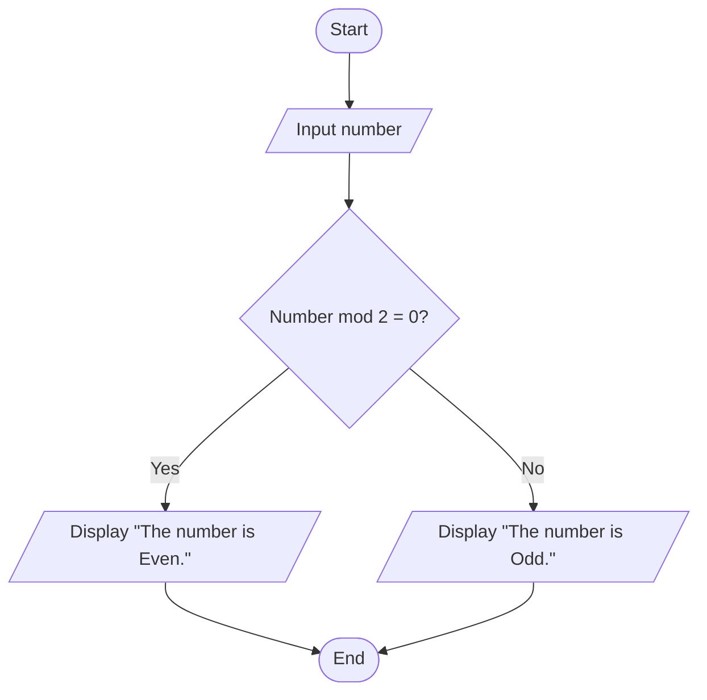

```mermaid
flowchart TB
A([Start]) --> B[/Input number/]
B --> C{Number mod 2 = 0?}
C -->|Yes| D[/Display "The number is Even."/]
C -->|No| E[/Display "The number is Odd."/]
D --> F([End])
E --> F([End])
```
